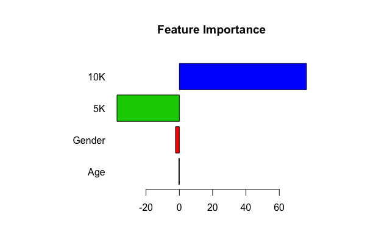
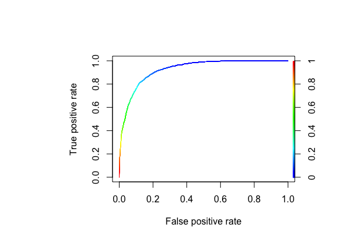

# Boston Marathon Data Analysis

As one of the biggest annual events, Boston Marathon has attracted thousands of participants from all over the world. I am interested in studying the factors that are important in determining the finishing time and ranking of runners. The data contains the information of participants in 2015, 2016 and 2017, and is obtained from Kaggle. I used linear regression to predict the finishing time from runners' age, gender, and time at 5K and 10K, obtaining an R square of 0.86. Logistic regression was used to predict whether a runner is ranked in the top 10% of her age division, leading to an out-of-sample AUC of 0.93.

The important predictors for finishing time (linear regression):

The ROC curve from logistic regression, used to predict whether a runner is ranked in the top 10% of her age division.

